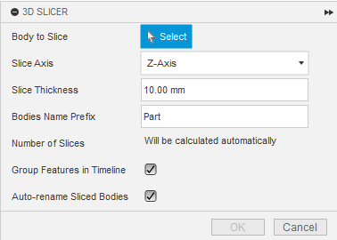
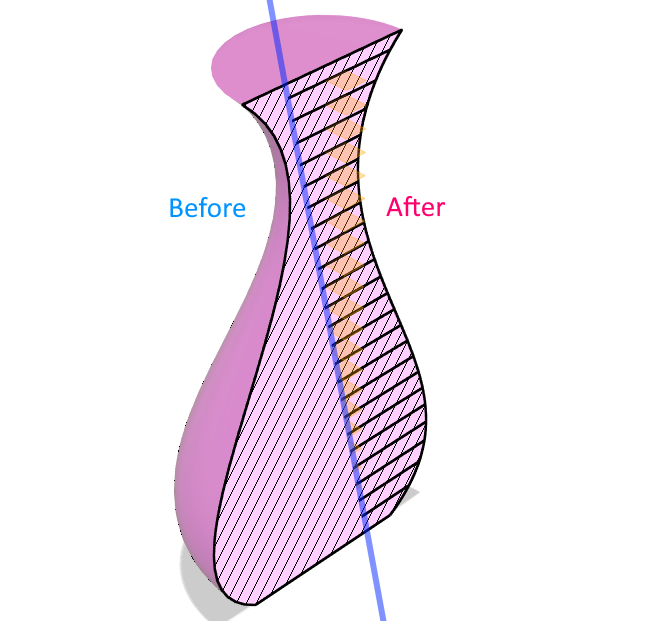
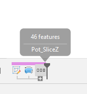

# JT 3D Slicer Pro for Autodesk® Fusion®

> Professional 3D slicing plugin for laser cutting preparation

## 🎬 Demo Video

https://github.com/jtplugin/fusion-3d-slicer/assets/demo-3d-slicer-pro.mp4

*Transform 3D models into laser-cut parts with professional precision*

## ✨ Features

### 🔧 **Parametric Slicing**
- Slice along **X, Y, or Z axis** with precision
- **Custom thickness** support (0.1mm to 5cm)
- **Real-time calculation** of slice count
- **Smart preview** with total dimensions

### 🎯 **Professional Workflow**
- **One-click operation** - select body and slice
- **Timeline organization** with automatic grouping
- **Sequential naming** with customizable prefixes
- **Undo-friendly** operation history

### 🏭 **Digital Fabrication Ready**
- **Laser cutting** optimized output
- **Material thickness** accurate slicing
- **Assembly-ready** numbered parts
- **Export-friendly** organized bodies

## 🚀 Quick Start

### Installation
1. Download from [Autodesk App Store](https://apps.autodesk.com) *(coming soon)*
2. Or install manually:
   - Download latest release
   - Extract to Fusion Add-ins folder
   - Restart Fusion 

### Usage
1. **Open** your 3D model in Fusion 
2. **Modify** → **3D Slicer Pro**
3. **Select** body to slice
4. **Choose** axis and thickness
5. **Click OK** and let the magic happen! ✨

## 📸 Screenshots

### Plugin Interface

*Clean, intuitive interface with real-time calculations*

### Before & After

*From solid 3D model to laser-cut ready parts*

### Timeline Organization

*Smart timeline management keeps your project organized*

## 🎯 Use Cases

### 🏗️ **Architecture & Design**
- Architectural models with layered sections
- Rapid prototyping with cardboard/plywood
- Exhibition displays and installations

### 🔬 **Education & Research**
- STEAM project preparation
- Anatomy models for teaching
- Engineering demonstrations

### 🎨 **Art & Craft**
- Custom decorative objects
- Jewelry and accessories
- Artistic installations

### 🏭 **Manufacturing**
- Prototype development
- Jigs and fixtures
- Custom packaging solutions

## ⚙️ Technical Specifications

### **Requirements**
- **Fusion **: Version 2.0.18000 or newer
- **Operating System**: Windows 10/11, macOS 10.15+
- **Memory**: 4GB RAM minimum, 8GB recommended
- **Storage**: 10MB for plugin installation

### **Supported Materials**
- **Plexiglass/Acrylic**: 1-10mm thickness
- **Wood/Plywood**: 0.5-20mm thickness
- **Cardboard**: 1-5mm thickness
- **MDF**: 2-25mm thickness
- **Custom materials**: Any thickness 0.1-50mm

### **Output Format**
- Native Fusion  bodies
- Ready for CAM operations
- Compatible with all Fusion  export formats

## 🛠️ Advanced Features

### **Smart Slicing Algorithm**
- **Intelligent plane generation** for optimal cuts
- **Precision tolerance** control
- **Overlap prevention** technology
- **Edge optimization** for clean cuts

### **Timeline Management**
- **Automatic grouping** of all operations
- **Feature naming** with logical sequence
- **History preservation** for easy modifications
- **Batch operations** support

### **User Experience**
- **Real-time feedback** on slice count
- **Input validation** prevents errors
- **Progress indication** for large models
- **Undo/Redo** full support

## 📞 Support

### **Documentation**
- **User Guide**: [Coming Soon]
- **Video Tutorials**: [YouTube Channel](https://youtube.com/@jtplugin)
- **FAQ**: [Common Questions](docs/FAQ.md)

### **Community**
- **Issues**: [Report bugs](https://github.com/jtplugin/fusion-3d-slicer/issues)
- **Discussions**: [Feature requests](https://github.com/jtplugin/fusion-3d-slicer/discussions)
- **Email**: [gianni.tommasi@gmail.com](mailto:gianni.tommasi@gmail.com)

### **Professional Support**
For commercial projects and custom development:
- **Email**: [gianni.tommasi@gmail.com](mailto:gianni.tommasi@gmail.com)
- **Response Time**: 24-48 hours
- **Custom Development**: Available upon request

## 📊 Performance

### **Benchmarks**
- **Small models** (< 1000 faces): < 5 seconds
- **Medium models** (1K-10K faces): 5-30 seconds  
- **Large models** (10K+ faces): 30-120 seconds
- **Complex geometry**: Automatic optimization

### **Limitations**
- **Maximum slices**: 100 per operation (safety limit)
- **Model size**: Up to 1m³ recommended
- **Memory usage**: Scales with model complexity

## 🔒 Privacy & Security

This plugin operates entirely locally within Fusion:
- ✅ **No data collection** or transmission
- ✅ **No internet connection** required
- ✅ **Your designs stay private** on your computer
- ✅ **GDPR compliant** by design

**Full Privacy Policy**: [jtplugin.github.io/privacy-policy](https://jtplugin.github.io/privacy-policy)

## 📈 Roadmap

### **Version 1.1** *(Q2 2025)*
- Batch processing multiple bodies
- Advanced nesting algorithms
- Material database integration

### **Version 1.2** *(Q3 2025)*
- CAM export integration
- Optimization engine for cut efficiency
- Advanced preview with assembly simulation

### **Future Versions**
- Multi-language support
- Cloud synchronization (optional)
- Integration with popular laser cutting services

## 🏆 About JT Plugin Development

**Giovanni Tommasi** - Digital Fabrication Specialist
- 🎓 Expertise in CAD/CAM and digital manufacturing
- 🏭 Professional experience in laser cutting workflows
- 💡 Passionate about making advanced tools accessible

**Company**: [JT Plugin Development](https://jtplugin.github.io)
**Other Projects**: [Plugin Portfolio](https://jtplugin.github.io/plugins)

## 📄 License

**Proprietary Software** - © 2025 JT Plugin Development
- Commercial use requires license from Autodesk App Store
- Modification and redistribution prohibited
- See [LICENSE](LICENSE) file for details

## ⭐ Reviews

*"Finally, a professional solution for laser cutting preparation in Fusion!"*
*"Saves hours of manual work - essential for any maker!"*
*"Clean interface, reliable results, exactly what I needed."*

---

**🚀 Ready to revolutionize your digital fabrication workflow?**  
**[Get 3D Slicer Pro on Autodesk App Store](#) ← *Coming Soon***

---

*Made with ❤️ for the Fusion community*
